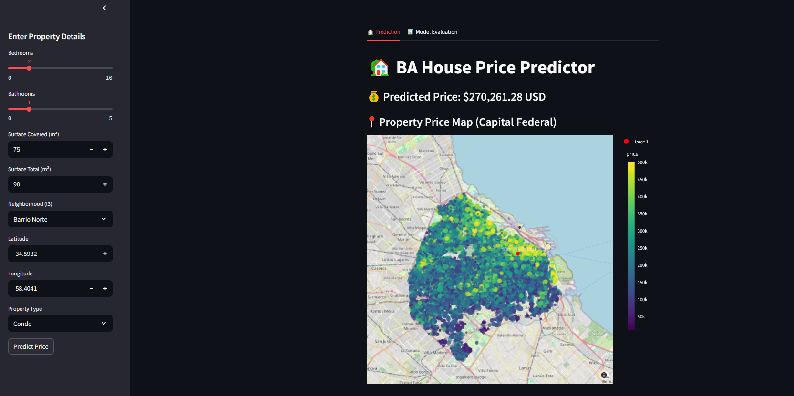
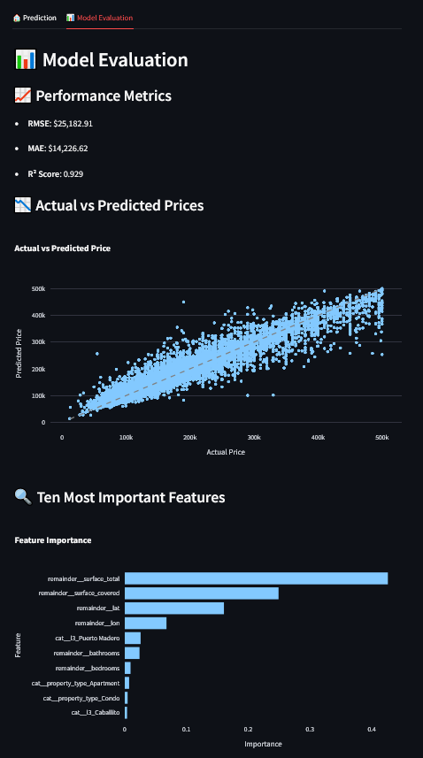

# 🏠 Buenos Aires House Price Predictor

[](LICENSE)

A machine learning project to estimate property prices in Buenos Aires using real estate listing data and geospatial insights. This project includes data preprocessing, model training, and a fully interactive Streamlit web application for real-time predictions and visualizations.

## 📊 Project Highlights

- End-to-end regression pipeline using Scikit-learn  
- Geospatial analysis with Mapbox via Plotly  
- Interactive Streamlit UI with input form, evaluation dashboard, and map  
- Predictive model for estimating home prices based on features like location, size, and type  

## 🔧 Setup Instructions
### Option 1: Using pip

```bash
pip install -r requirements.txt
```
### Option 2: Using Conda
```bash
conda env create -f environment.yml
conda activate ba-price-predictor
```
### **NOTE**

**The model pkl file is too large to be uploaded into this repo. To get the model, you can train the model and place in the model directory. The model paramaters can be found in the Jupyter Notebook**

**Or you can run the following bash script in the terminal of your virtual environment at the project directory to automate the task for you**
```bash
python model.py
```


## 📁 Dataset

- **Source:** [Kaggle – BSAS Real Estate on Sale](https://www.kaggle.com/datasets/alejandromendivil/bsas-realstate-on-sale/data)
- **Raw Columns Used:**
  - price, bedrooms, bathrooms  
  - surface_covered, surface_total  
  - lat, lon, l3 (neighborhood), property_type  

**Please download the data or use the link provided in the source if you want to create the files in the data folder yourself.** 

## 🧠 ML Pipeline

The model pipeline was built using Scikit-learn and includes:

```python
Pipeline([
    ("preprocessor", ColumnTransformer([...], remainder="drop")),
    ("model", RandomForestRegressor())
])
```


## Key Components
  * One-hot encoding for categorical variables

  * Filtering and imputation for numerical features

  * RandomForestRegressor trained on cleaned data

  * Evaluation metrics: RMSE, MAE, R² Score

## 🚀 Streamlit App

To launch the app locally, run:
```bash
streamlit run app.py
```

### Tabs

  * 🏘 Prediction: User inputs through a sidebar form

  * 📊 Evaluation: Model performance, error metrics, and feature importances

### Features

  * Dynamic selection of neighborhoods and valid lat/lon ranges

  * Real-time prediction with price overlayed on Mapbox scatter plot

  * Metrics include RMSE, MAE, and R²

  * Actual vs. Predicted price scatter plot

  * Feature importance bar chart (for compatible models)

## 📈 Sample Results

| Metric       | Value       |
| ------------ | ----------- |
| **RMSE**     | \$25,182.91 |
| **MAE**      | \$14,226.62 |
| **R² Score** | 0.929       |

### 💡 Future Work

  * Improve model generalization with hyperparameter tuning (e.g., Optuna)

  * Deploy the app via Hugging Face Spaces or a cloud platform (AWS, GCP)

  * Enhance the UI with better theming and mobile responsiveness

### 🧑‍💻 Author

Developed by a data science enthusiast exploring the intersection of machine learning, user experience, and location intelligence.

  *  📫 Feel free to connect on [LinkedIn](https://www.linkedin.com/in/shahriar-islam-75567a160/) or [GitHub](https://github.com/Shahriar-77)

  * 🎓 Built as part of a growing AI portfolio

## 📜 License

This project is for educational purposes only. Do not use for real estate decision-making without verifying predictions independently.

## 🖼️ Screenshots

Below are snapshots of the Streamlit web application in action.



*Prediction tab: Enter property details and view the estimated price.*



*Evaluation tab: Model performance metrics, actual vs predicted plot, and feature importances.*